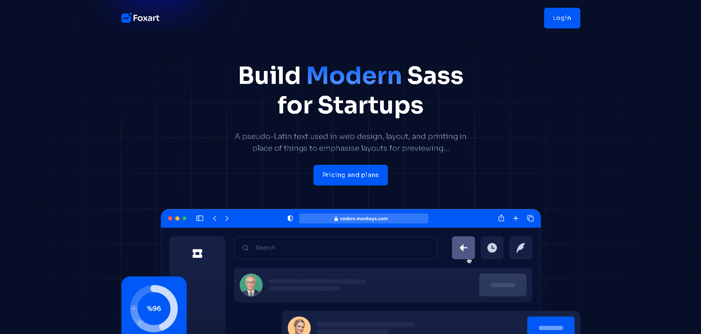
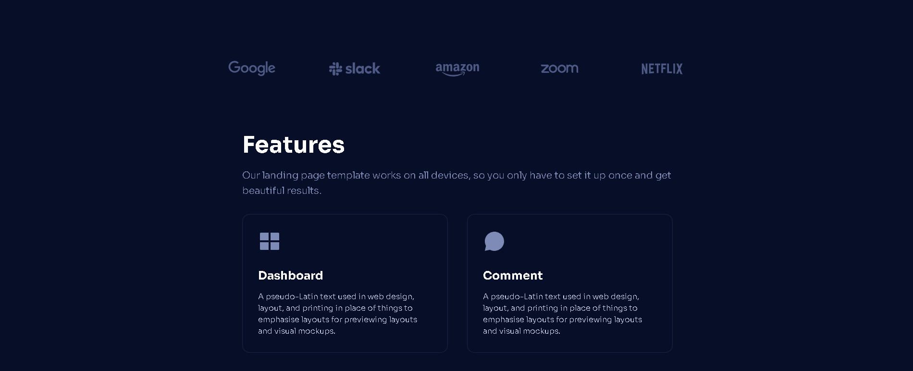
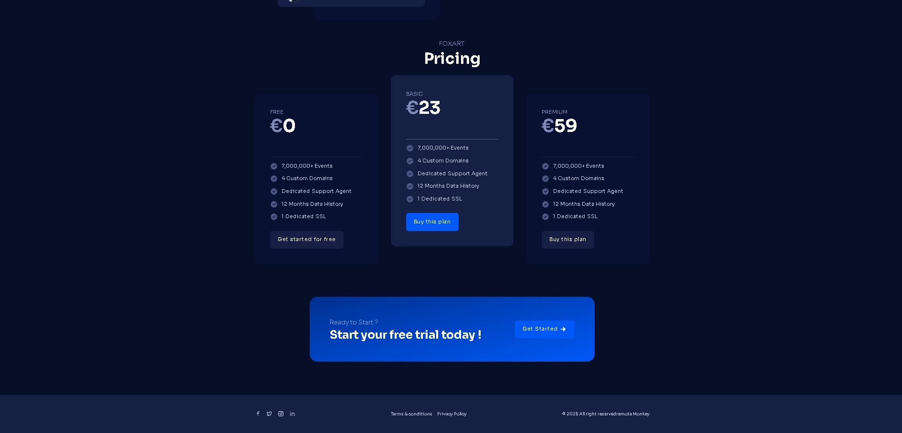
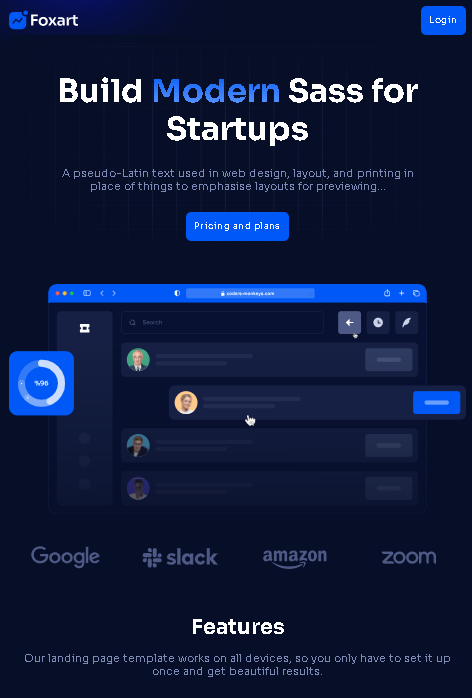
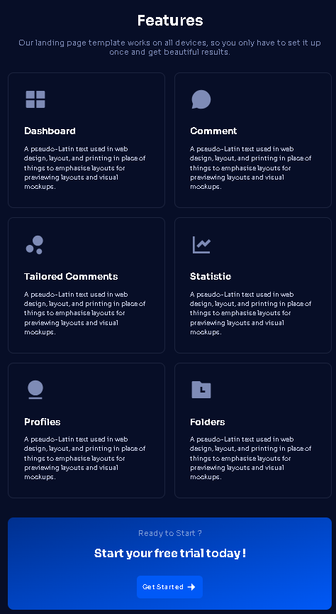
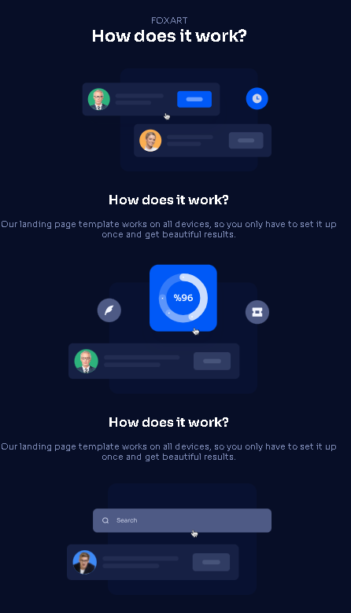
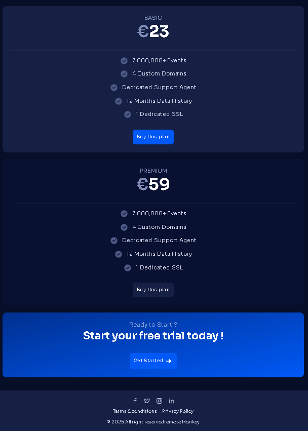

# 📦 Foxart

Ce projet est une application React avec une interface utilisateur dynamique, comprenant des sections telles que des marques, des points clés, des boutons stylisés, des appels à l'action, des fonctionnalités, ainsi qu'un pied de page. L'application est entièrement responsive grâce à Tailwind CSS et propose une gestion fluide du rendu des composants.

## 📁 Structure du Projet

### Composants principaux :
- **Container** : Conteneur générique pour organiser et centrer les éléments.
- **Branding** : Affiche des logos de marques avec une mise en page responsive.
- **BulletPoints** : Liste de points importants, chaque point ayant une image et une description, avec des mises en page dynamiques.
- **Button** : Boutons stylisés permettant de naviguer ou de soumettre des actions avec des thèmes différents (primaire et secondaire).
- **CallToAction** : Section engageant l'utilisateur à démarrer un essai gratuit avec un bouton de call-to-action.
- **Footer** : Pied de page avec des liens sociaux et des informations sur la politique de confidentialité et les conditions d'utilisation.
- **Headings** : Gère l'affichage des titres principaux et secondaires.
- **Header** : En-tête de la page avec un logo et un bouton de connexion.
- **Hero** : Section principale du site avec un titre percutant et un bouton d'appel à l'action pour accéder aux plans tarifaires.
- **Pricing** : Affiche les plans tarifaires avec les fonctionnalités incluses et un bouton pour s'abonner.
- **Features** : Présente les fonctionnalités de l'application, chacune accompagnée d'une image et d'une description.

## 🎨 Fonctionnalités
- **Branding** : Affiche les logos des marques partenaires.
- **BulletPoints** : Liste de points importants avec des images et des titres.
- **Button** : Boutons réactifs pour l'interaction avec l'utilisateur.
- **CallToAction** : Invitation à démarrer un essai gratuit.
- **Footer** : Liens sociaux, conditions d'utilisation et informations légales.
- **Headings** : Affichage dynamique des titres de section.
- **Header** : En-tête avec logo et option de connexion.
- **Hero** : Section d'introduction avec un message captivant.
- **Pricing** : Plans tarifaires avec options d'abonnement.
- **Features** : Liste des fonctionnalités avec des visuels attractifs.

## 🛠️ Technologies utilisées
- **React** : Framework JavaScript pour construire l'interface utilisateur.
- **Tailwind CSS** : Utilisé pour les styles réactifs et personnalisés.
- **JavaScript** : Pour la gestion de la logique des composants.

## 📸 Illustrations

### Illustration pour la version Web
Voici des illustrations adaptée aux grands écrans :

  

    
    
  

  

    
    
  

### Illustration pour la version Mobile
Voici des illustrations adaptée aux petits écrans :

  
  

  
  

## 📌 Améliorations possibles
- Ajouter un système de gestion de l'état global avec Redux ou Context API.
- Ajouter des animations interactives pour améliorer l'expérience utilisateur.
- Implémenter un système d'authentification pour accéder aux fonctionnalités premium.
- Intégrer une gestion dynamique des prix avec un back-end pour personnaliser les plans en fonction des utilisateurs.

---

Ce projet a été réalisé par **[Remote Monkey](https://www.youtube.com/watch?v=1oGo9QYpAMU)**.
