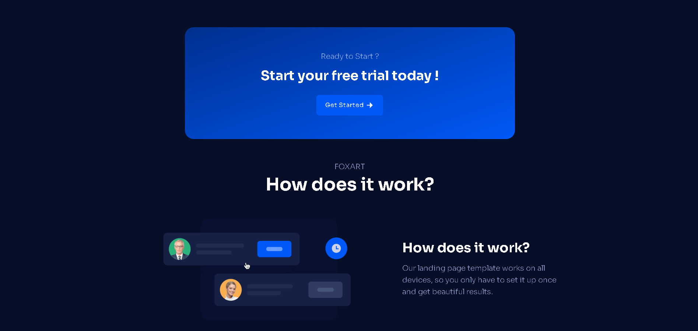

# 📦 Foxart

Ce projet est une application React avec une interface utilisateur dynamique, comprenant des sections telles que des marques, des points clés, des boutons stylisés, des appels à l'action, des fonctionnalités, ainsi qu'un pied de page. L'application est entièrement responsive grâce à Tailwind CSS et propose une gestion fluide du rendu des composants.

## 📁 Structure du Projet

### Composants principaux :

```plaintext
project : Landing page saas
├── node_modules
├── public                 /* Dossier pour les fichiers publics et statiques accessibles directement */
├── src                    /* Contient tous les fichiers sources du projet */
│   ├── assets             /* Dossier pour les images et ressources statiques */
│   ├── components         /* Composants réutilisables */
│   ├── theme              /* Dossier contenant les composants thématiques */
│   │   ├── Branding       /* Composant pour l'affichage des logos des marques */
│   │   ├── BulletPoints   /* Composant pour la liste des points importants */
│   │   ├── Button         /* Composant pour les boutons stylisés */
│   │   ├── CallToAction   /* Composant pour l'appel à l'action */
│   │   ├── Footer         /* Composant pour le pied de page */
│   │   ├── Headings       /* Composant pour les titres */
│   │   ├── Header         /* Composant pour l'en-tête */
│   │   ├── Hero           /* Composant pour la section principale */
│   │   ├── Pricing        /* Composant pour afficher les plans tarifaires */
│   │   └── Features       /* Composant pour afficher les fonctionnalités */
│   ├── constants          /* Contient les constantes globales utilisées dans l'application */
```

## 🎨 Fonctionnalités
- **Branding** : Affiche les logos des marques partenaires.
- **BulletPoints** : Liste de points importants avec des images et des titres.
- **Button** : Boutons réactifs pour l'interaction avec l'utilisateur.
- **CallToAction** : Invitation à démarrer un essai gratuit.
- **Footer** : Liens sociaux, conditions d'utilisation et informations légales.
- **Headings** : Affichage dynamique des titres de section.
- **Header** : En-tête avec logo et option de connexion.
- **Hero** : Section d'introduction avec un message captivant.
- **Pricing** : Plans tarifaires avec options d'abonnement.
- **Features** : Liste des fonctionnalités avec des visuels attractifs.

## 🛠️ Technologies utilisées
- **React** : Framework JavaScript pour construire l'interface utilisateur.
- **Tailwind CSS** : Utilisé pour les styles réactifs et personnalisés.
- **JavaScript** : Pour la gestion de la logique des composants.

## 📸 Illustrations

### Illustration pour la version Web
Voici des illustrations adaptée aux grands écrans :

<div>
  <div style="display: flex; justify-content: space-between;">
    
    
  </div>
  <div style="display: flex; justify-content: space-between; margin-top: 16px;">
    
    
  </div>
</div>

### Illustration pour la version Mobile
Voici des illustrations adaptée aux petits écrans :

<div style="display: flex; justify-content: space-between;">
  
  
  
  
</div>

## 📌 Améliorations possibles
- Ajouter un système de gestion de l'état global avec Redux ou Context API.
- Ajouter des animations interactives pour améliorer l'expérience utilisateur.
- Implémenter un système d'authentification pour accéder aux fonctionnalités premium.
- Intégrer une gestion dynamique des prix avec un back-end pour personnaliser les plans en fonction des utilisateurs.

## 🔧 Prérequis

Avant de démarrer le projet en local, assurez-vous d'avoir installé les prérequis suivants :
- **Node.js** (version 14 ou supérieure)
- Vous pouvez télécharger et installer **Node.js** ici : [https://nodejs.org/](https://nodejs.org/)
- **npm** (Node Package Manager) ou **Yarn**

---

Ce projet a été réalisé par **[Remote Monkey](https://www.youtube.com/watch?v=1oGo9QYpAMU)**.
